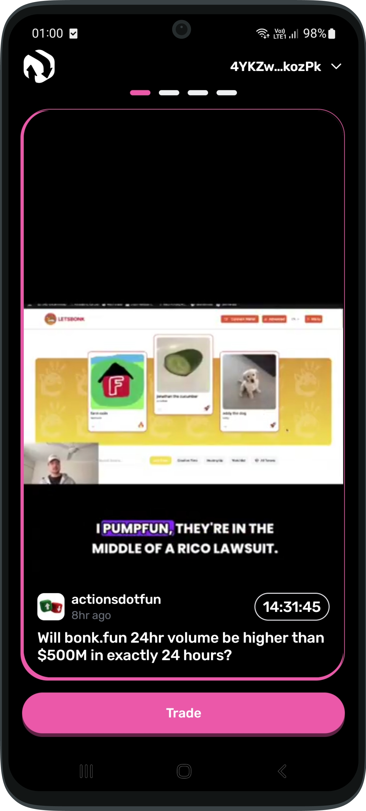
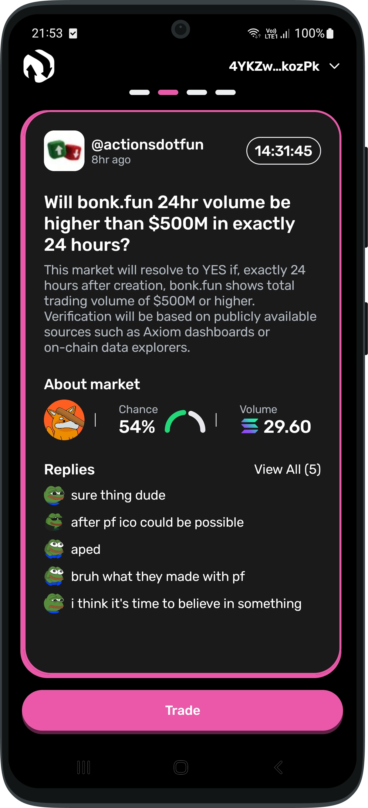
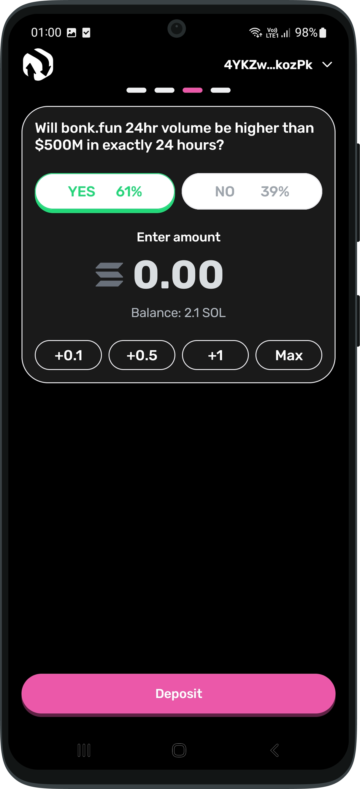
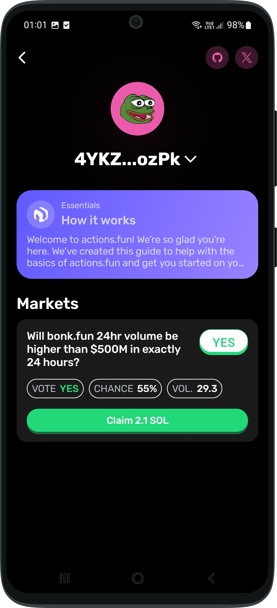

# actions.FUN
Official Android app for the [actions.fun](https://app.actions.fun)

# Overview
This repository contains the open source actions.fun Android client.

  
  
  
  

# Compilation Guide

### Requirements
You will need:
- Android Studio (latest stable version recommended)
- Android SDK API 34 or higher
- Android NDK (latest LTS version)
- JDK 17 or higher
- Git

### Setup Instructions
- Clone the repository
- `bash git clone https://github.com/actionsprotocol/actions-android.git`
- `cd actions-android`
- Open in Android Studio
- Launch Android Studio
- Select "Open an existing project"
- Navigate to the cloned repository folder

## Building Release APK

### Configure Signing
- Navigate to `app.actionsfun.environment.Signing`
- Modify the release configuration with your own values:
  - keyStorePassword = "your_store_password"
  - keyAlias = "your_key_alias"
  - keyPassword = "your_key_password"

## Network Configuration
By default, the app uses devnet for development builds and mainnet for release builds. 

To modify network settings:
- Navigate to `app.actionsfun.common.network.backendurl.BackendUrl`
- Update the backend URLs as needed for your environment

## Build Commands

### Debug build
`bash./gradlew assembleDebug`

### Release build
`./gradlew assembleRelease`

### Install debug on connected device:
`./gradlew installDebug`